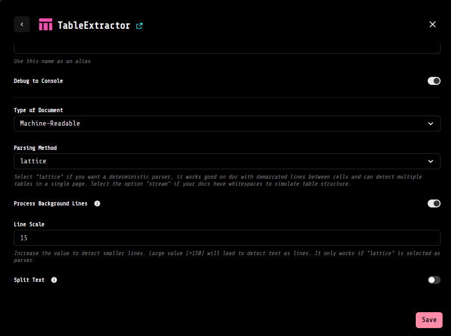
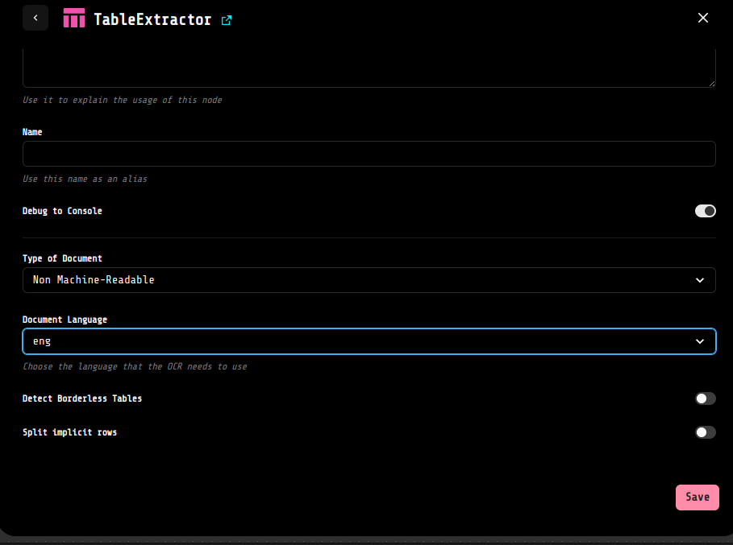

# :clipboard: TABLE EXTRACTOR: a LOKO AI extension for extract content from documents with table

The table_extractor extension allows to parse documents containing table and extract them. 

This extension contains a block **"TableExtractor"**, which can auto-detect if the documents is machine readable or not and apply the most appropriate alghorithm. Nevertheless, you can select and choose the type of documents you want to parse, and specify also some parameters to enhance the extraction.

## :wrench: Configuration

Each of the two available options have different configuration available. Let's see them in details.

### :computer: Machine-Readable documents

In case of Machine-Readable docs, if you want to configure advance settings it's possible to set the following parameters:

- **Parsing method:** you can either choose _"lattice"_ method or the _"stream"_ method, based on the type of document you expect to have. If you have demarcated lines between cell or multiple tables in a single page you can use "lattice" which works in a deterministic way. In case your documents have whitespaces to simulate the table structure, the "stream" option will "guess" the table areas based on the text;
- **Process Background Lines:** with this parameter you can decide if you want to detect also table with lines in the background. It will be taken in consideration only if "lattice" is selected as parser; 
- **Line Scale:** this value represent the scale of the lines to take in consideration. The default value is 15, if you want to detect smaller lines you need to increase this number. Large value (>150) could lead to detect text as lines. As for the aforementioned parameter, also this one, will be taken in consideration only if "lattice" is selected as parser; 
- **Process Background Lines:** toggle this parameter if you want to split the text that spans across multiple cells.

### :page_with_curl: Non Machine-Readable documents

In case of Non Machine-Readable documents, if you want, it's possible to configure the following parameters:

- **Document Language:** you can select the language to use in the OCR instance. At the moment it's possible to choose between english and italian;
- **Detect Bordeless Tables:** toggle this option if you know your documents may have tables not delimited by border;
- **Split Implicit Rows:** toggle this parameter if you want to consider rows not divided by explicit border/line as seperated rows. If this field is untoggled, the rows will be join in one single row.

